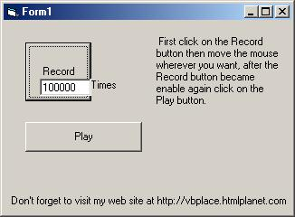

<div align="center">

## Simulate the cursor


</div>

### Description

It simulates the cursor. When you move the mouse it records all the movments and then you can simply see what you done! It's a good base to make a powerful program.--Please don't hate me because this is my first time and I hope it doesn't be the last time to upload such programs too.
 
### More Info
 
Mouse movement

Just to show computer can do anything without us not too many years later.

Mouse movment

Can't move cursor while the program is running.


<span>             |<span>
---                |---
**Submitted On**   |2001-05-30 15:03:20
**By**             |[Soheil Yasrebi](https://github.com/Planet-Source-Code/PSCIndex/blob/master/ByAuthor/soheil-yasrebi.md)
**Level**          |Intermediate
**User Rating**    |4.8 (24 globes from 5 users)
**Compatibility**  |VB 3\.0, VB 4\.0 \(16\-bit\), VB 4\.0 \(32\-bit\), VB 5\.0, VB 6\.0
**Category**       |[Windows API Call/ Explanation](https://github.com/Planet-Source-Code/PSCIndex/blob/master/ByCategory/windows-api-call-explanation__1-39.md)
**World**          |[Visual Basic](https://github.com/Planet-Source-Code/PSCIndex/blob/master/ByWorld/visual-basic.md)
**Archive File**   |[Simulate t202905302001\.zip](https://github.com/Planet-Source-Code/soheil-yasrebi-simulate-the-cursor__1-23600/archive/master.zip)

### API Declarations

```
GetCursorPos
SetCursorPos
```


